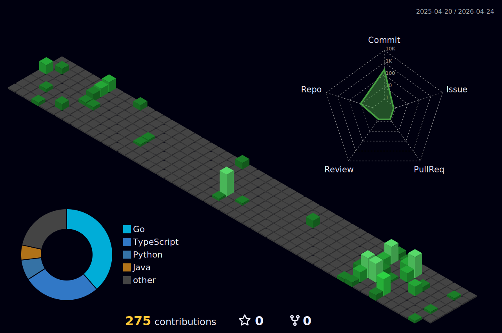

<a href="https://github.com/JadenRazo">
  
</a>

---

### `$ cat about.txt`

```
Full-stack developer building production systems from frontend to bare metal.
I design web platforms, deploy containerized services, and maintain custom
Minecraft server forks. Most of my work lives in Go, Java, TypeScript, and Python.
```

---

### `$ cat skills.txt`

```
LANGUAGES       Go · Java · TypeScript · Python · SQL · Shell
FRONTEND        React · Astro · Tailwind CSS · Redux · HTMX
BACKEND         Fiber · Node.js · Express · Discord.py · JDA
DATA            PostgreSQL · MariaDB · SQLite · Redis
INFRA           Docker · Caddy · Nginx · GitHub Actions · SSH
MINECRAFT       Paper API · Velocity · ProtocolLib · NMS
```

---

### `$ ls -la projects/`

```
drwxr-xr-x  jaden  staff   projects/
```

| Repository | Description | Stack |
|:-----------|:------------|:------|
| [EzWeb](https://github.com/JadenRazo/EzWeb) | Docker site deployment platform with Caddy, health checks, and SSE streaming | Go, Fiber, SQLite, HTMX, Docker |
| [Project-Website](https://github.com/JadenRazo/Project-Website) | Portfolio with URL shortener, real-time messaging, and dev panel | React, TypeScript, Go |
| [TicketHacker](https://github.com/JadenRazo/TicketHacker) | Unified helpdesk — Discord, Telegram, email, live chat in one ticketing system | TypeScript, React, Node.js |
| [SurvivalCore](https://github.com/JadenRazo/SurvivalCore) | Paper 1.21.8 fork with async entity tracking, SIMD math, hopper caching | Java, Paper API |
| [Showers Auto Detailing](https://github.com/JadenRazo/showersautodetail) | Business site with quote calculator, booking, and Square payments | Astro, React, Node.js, PostgreSQL |
| [ServerPlugins](https://github.com/JadenRazo/ServerPlugins) | 24 interconnected Minecraft plugins — claims, economy, events, casino, admin | Java 21, Maven, Paper API |
| [Quiz-Bot](https://github.com/JadenRazo/Quiz-Bot) | Discord bot using LLMs for educational quiz games | Python, Discord.py |

---

### `$ systemctl status ezweb-sites`

<!-- DEPLOY_MONITOR_START -->
```
$ ezweb status
SITE                           STATE      HTTP   LATENCY    CONTAINER   
----------------------------------------------------------------------
jadenrazo.dev                  running    403    137ms      not_found   
tickets.jadenrazo.dev          running    403    119ms      not_found   
client-site-1.example          running    —      —          not_found   
client-site-2.example          running    200    407ms      not_found   
client-site-3.example          running    200    523ms      not_found   
client-site-4.example          running    —      5009ms     not_found   

Last check: 2026-02-19T21:28:45Z
```
<!-- DEPLOY_MONITOR_END -->

*Refreshed every 30 minutes via [GitHub Actions](.github/workflows/deploy-monitor.yml)*

---

### `$ cloc --by-language ~/repos/`

<!-- LOC_START -->
**365,462** lines of code across **458,788** total lines

| Language | Lines of Code | % |
|----------|-------------:|--:|
| Java | 137,769 | 37.7% |
| TypeScript | 52,579 | 14.4% |
| Go | 50,972 | 13.9% |
| JSON | 35,806 | 9.8% |
| Python | 22,548 | 6.2% |
| YAML | 18,057 | 4.9% |
| Markdown | 17,726 | 4.9% |
| diff | 13,079 | 3.6% |
| Bourne Shell | 4,053 | 1.1% |
| SQL | 3,432 | 0.9% |
| JavaScript | 2,676 | 0.7% |
| CSS | 2,262 | 0.6% |
<!-- LOC_END -->

*Updated weekly + on every push via [GitHub Actions](.github/workflows/loc-counter.yml)*

---

### `$ git log --oneline --graph`



*Generated daily via [GitHub Actions](.github/workflows/profile-3d.yml)*

---

### `$ uptime`


