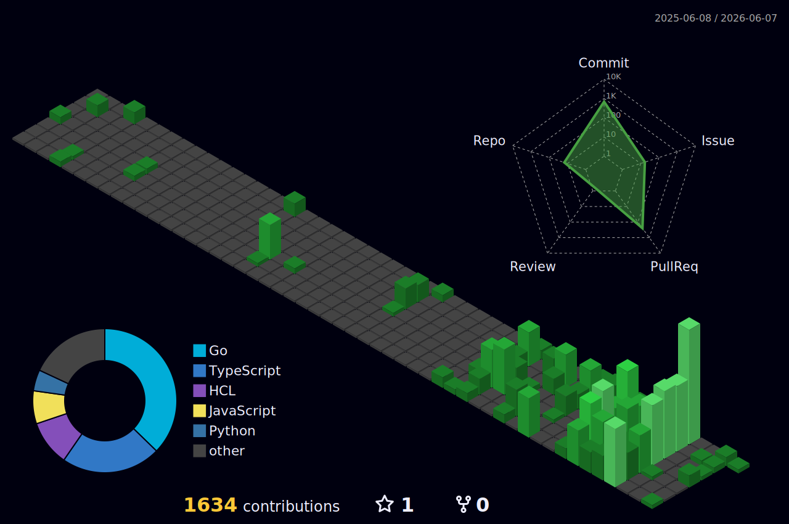

<a href="https://github.com/JadenRazo">
  
</a>

---

### `$ cat about.txt`

```
Full-stack developer building production systems from frontend to bare metal.
I design web platforms, deploy containerized services, and maintain custom
Minecraft server forks. Most of my work lives in Go, Java, TypeScript, and Python.
```

---

### `$ cat skills.txt`

```
LANGUAGES       Go · Java · TypeScript · Python · SQL · Shell
FRONTEND        React · Astro · Tailwind CSS · Redux · HTMX
BACKEND         Fiber · Node.js · Express · Discord.py · JDA
DATA            PostgreSQL · MariaDB · SQLite · Redis
INFRA           Docker · Caddy · Nginx · GitHub Actions · SSH · Terraform
CLOUD           AWS · Azure · GCP · Active Directory · Windows Server
MINECRAFT       Paper API · Velocity · ProtocolLib · NMS
```

---

### `$ ls -la projects/`

```
drwxr-xr-x  jaden  staff   projects/
```

| Repository | Description | Stack |
|:-----------|:------------|:------|
| [raizhost-infra](https://github.com/JadenRazo/raizhost-infra) | GitOps source of truth for the RaizHost k3s platform — every ArgoCD app, ingress, and policy lives here | k3s, ArgoCD, Kustomize, OPA |
| [CloudCostMCP](https://github.com/JadenRazo/CloudCostMCP) | MCP server for multi-cloud Terraform cost analysis across AWS, Azure, and GCP | TypeScript, Node.js, SQLite |
| [job-scanner](https://github.com/JadenRazo/job-scanner) | 24/7 ATS job scanner with Claude-based scoring and cover-letter drafting | TypeScript, Node.js, Python, Redis |
| [Project-Website](https://github.com/JadenRazo/Project-Website) | Portfolio with URL shortener, real-time messaging, and dev panel | React, TypeScript, Go |
| [TicketHacker](https://github.com/JadenRazo/TicketHacker) | Unified helpdesk — Discord, Telegram, email, live chat in one ticketing system | TypeScript, React, Node.js |
| [SurvivalCore](https://github.com/JadenRazo/SurvivalCore) | Paper 1.21.8 fork with async entity tracking, SIMD math, hopper caching | Java, Paper API |
| [Showers Auto Detailing](https://github.com/JadenRazo/showersautodetail) | Business site with quote calculator, booking, and Square payments | Astro, React, Node.js, PostgreSQL |
| [ServerPlugins](https://github.com/JadenRazo/ServerPlugins) | 24 interconnected Minecraft plugins — claims, economy, events, casino, admin | Java 21, Maven, Paper API |
| [initializing-ad](https://github.com/JadenRazo/initializing-ad) | Active Directory lab — domain controller, DNS, group policy, and enterprise onboarding | Windows Server 2022, VirtualBox |
| [Quiz-Bot](https://github.com/JadenRazo/Quiz-Bot) | Discord bot using LLMs for educational quiz games | Python, Discord.py |

---

### `$ cloc --by-language ~/repos/`

<!-- LOC_START -->
**444,537** lines of code across **557,390** total lines

| Language | Lines of Code | % |
|----------|-------------:|--:|
| Java | 137,769 | 31.0% |
| TypeScript | 104,680 | 23.5% |
| Go | 65,682 | 14.8% |
| JSON | 35,809 | 8.1% |
| Python | 22,570 | 5.1% |
| Markdown | 19,860 | 4.5% |
| YAML | 19,114 | 4.3% |
| diff | 13,079 | 2.9% |
| Vuejs Component | 6,111 | 1.4% |
| Bourne Shell | 5,030 | 1.1% |
| SQL | 4,177 | 0.9% |
| CSS | 3,519 | 0.8% |
<!-- LOC_END -->

*Updated weekly + on every push via [GitHub Actions](.github/workflows/loc-counter.yml)*

---

### `$ git log --oneline --graph`




*Generated daily via [GitHub Actions](.github/workflows/profile-3d.yml)*

---

### `$ raizhost-infra status`

<!-- DEPLOY_MONITOR_START -->
```
$ raizhost-infra status
SITE                           STATE      HTTP   LATENCY   
----------------------------------------------------------
raizhost.com                   up         200    43ms      
app.raizhost.com               up         307    35ms      
jadenrazo.dev                  up         200    41ms      
claude.raizhost.com            up         200    545ms     
showersautodetail.com          up         200    41ms      

Last check: 2026-05-01T07:00:01Z
```
<!-- DEPLOY_MONITOR_END -->

*Probed every 30 min by a cron on USW-32GB-MAIN running [raizhost-infra/scripts/probe-profile-status.sh](https://github.com/JadenRazo/raizhost-infra/blob/main/scripts/probe-profile-status.sh); dispatched to this repo and rendered by [deploy-monitor.yml](.github/workflows/deploy-monitor.yml).*
